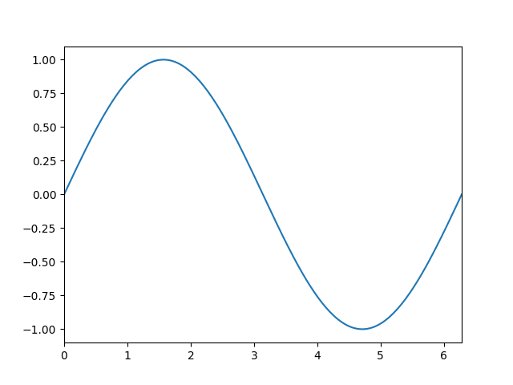

# matplotloom

Weave your frames into matplotlib animations.

## Why use matplotloom?

* The main idea behind matplotloom is to describe how to generate each frame of your animation from scratch, instead of generating an animation by modifying one existing plot. This simplifies generating animations. See the examples below and how the code inside the `for` loops is plain and familiar matplotlib. It also ensures that every feature can be animated and that the generation process can be easily parallelized.
* matplotlib has two tools for making animations: `FuncAnimation` and `ArtistAnimation`. But to use them you have to write your plotting code differently to modify an existing frame. This makes it difficult to go from plotting still figures to making animations. And some features are non-trivial to animate.
* [celluloid](https://github.com/jwkvam/celluloid) is a nice package for making matplotlib animations easily, but as it relies on `ArtistAnimation` under the hood it does come with some [limitations](https://github.com/jwkvam/celluloid?tab=readme-ov-file#limitations) such as not being able to animate titles. It also hasn't been maintained since 2018.
* Plotting many frames (hundreds to thousands+) can be slow but with matplotloom you can use a parallel `Loom` to plot each frame in parallel, speeding up the animation process significantly especially if you can dedicate many cores to plotting.

## Notes?

* You have to call `loom.save_frame(fig)` for each frame. While the `Loom` object can be made to do this automatically it would have to create and own the `Figure` instance and I wanted full control over the creation of the `Figure`.

## Installation

matplotloom is published on PyPI so you can install matplotloom via `pip`

```bash
pip install matplotloom
```

or `poetry`

```bash
poetry add matplotloom
```

or `conda`

```bash
conda install matplotloom
```

matplotloom requires Python 3.9+ and is continuously tested on Linux, Windows, and Mac. Ensure you have `ffmpeg` installed so that animations can be generated.

## Examples

### Sine wave

```python
import numpy as np
import matplotlib.pyplot as plt
from matplotloom import Loom

with Loom("sine_wave_animation.gif", fps=30) as loom:
    for phase in np.linspace(0, 2*np.pi, 100):
        fig, ax = plt.subplots()

        x = np.linspace(0, 2*np.pi, 200)
        y = np.sin(x + phase)
        
        ax.plot(x, y)
        ax.set_xlim(0, 2*np.pi)
        
        loom.save_frame(fig)
```



### Rotating circular sine wave

```python
import numpy as np
import matplotlib.pyplot as plt
from matplotloom import Loom

with Loom("rotating_circular_sine_wave.mp4", fps=10) as loom:
    for i in range(36):
        fig, ax = plt.subplots(figsize=(12, 8), subplot_kw={"projection": "3d"})
        
        X = np.arange(-5, 5, 0.25)
        Y = np.arange(-5, 5, 0.25)
        X, Y = np.meshgrid(X, Y)
        R = np.sqrt(X**2 + Y**2)
        Z = np.sin(R)
        
        surf = ax.plot_surface(X, Y, Z, cmap="coolwarm")
        
        ax.view_init(azim=i*10)
        ax.set_zlim(-1.01, 1.01)
        fig.colorbar(surf, shrink=0.5, aspect=5)

        loom.save_frame(fig)
```

https://github.com/ali-ramadhan/matplotloom/assets/20099589/77f2f0a2-6be1-46f6-b4ba-32a44b11441b

## Parallel mode

By passing `parallel=True` when creating a `Loom`, you can save frames using `loom.save_frame(fig, frame_number)` which allows you to plot and save all your frames in parallel. One easy way to leverage this is by using joblib to parallelize the for loop. For example, here's how you can parallelize the simple sine wave example:

```python
import numpy as np
import matplotlib.pyplot as plt
from matplotloom import Loom
from joblib import Parallel, delayed

def plot_frame(phase, frame_number, loom):
    fig, ax = plt.subplots()

    x = np.linspace(0, 2*np.pi, 200)
    y = np.sin(x + phase)
    
    ax.plot(x, y)
    ax.set_xlim(0, 2*np.pi)
    
    loom.save_frame(fig, frame_number)

with Loom("parallel_sine_wave.gif", fps=30, parallel=True) as loom:
    phases = np.linspace(0, 2*np.pi, 100)
    
    Parallel(n_jobs=-1)(
        delayed(plot_frame)(phase, i, loom) 
        for i, phase in enumerate(phases)
    )
```
